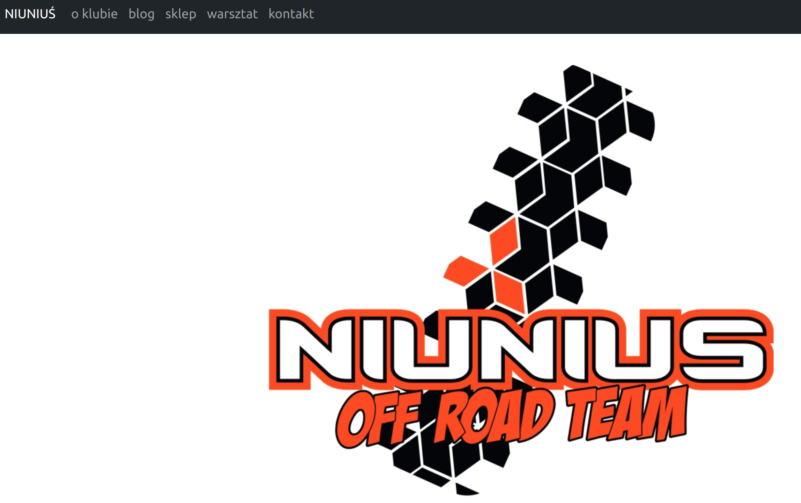
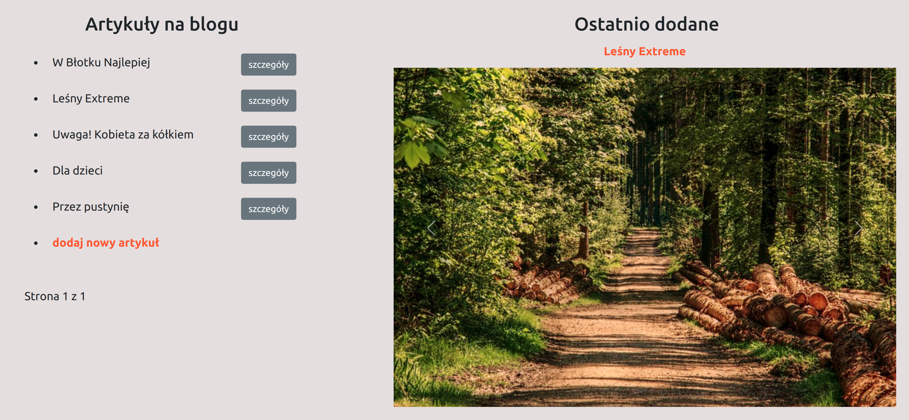
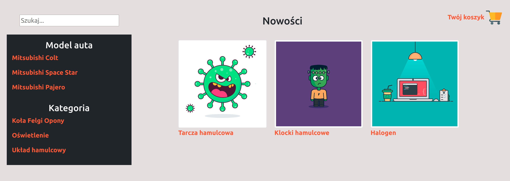

Thank you for your interest in my project. Below you can read what it is about.

# NIUNIUŚ
In general, this Django app might be the website template for any club. In particular, the app was created for the off-road club named "Niuniuś", so that's why you may find here few customized elements, like the logo on the home page which you can see on the screenshot below.


## Start

To start exploring the project:
1. clone this repository
2. create the virtual environment and install requirements`pip install -r requirements.txt`
3. configure a database - in the project directory you need to create the file named ***local_settings.py*** and add there DATABASES with details of the database connection.
   These details will be imported by Django as in the file `setting.py` the following code is included:
   ```python
    try:
        from my_django_project.local_settings import *
    except ImportError:
        pass
    ```
4. run the command `python manage.py migrate`
5. load initial data to fill your database - use the command `python manage.py loaddata */fixtures/*.json`
6. create a superuser to access the admin site: ` python manage.py createsuperuser`
7. open additional terminal window and run `python -m smtpd -n -c DebuggingServer localhost:1025` - this is required by email settings, in this terminal you will see sent messages
8. that's all, run `python manage.py runserver` and enjoy the app :-)

As for the app content, besides the home page already mentioned and shown, there are few more pages. These are:
about page, blog page, shop page, car service station page and contact page. A short description of each follows...

### About

This is one of articles from the blog, a specific one - with information about the club (like history, members etc.)

### Blog 



The blog is for articles, accessible to all users. Everyone can give a thumb up or thumb down, and see comments. 
Extra functionalities as adding and editing articles are reserved for logged-in users.

### Shop



The shop is for car parts. You can search by car models or by categories, or type whatever you are looking for in the search box.
Products are assigned to car models and to categories.
All users can make shopping, why not. You do not have to create an account on the website as this may discourage potential clients.
However, placing orders as a logged-in user allow you to check the orders' history on your profile page.

### Car Service Station

Users may review car services offer and book a visit. 

### Contact

The contact page with the address and the map. Additionally, user can send a message to the site/club owner.

## The end

Thank you one more time for your interest.
If you find anything should be added/amended/deleted in this project, you are very welcome to create pull requests. 
