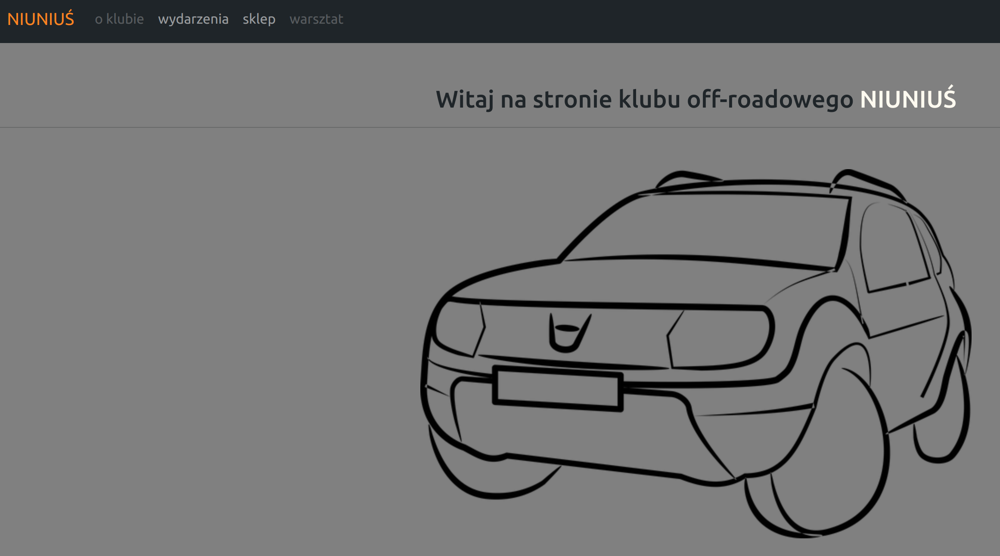
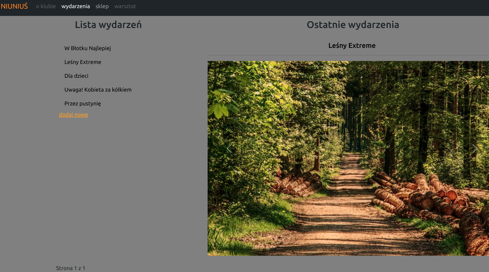
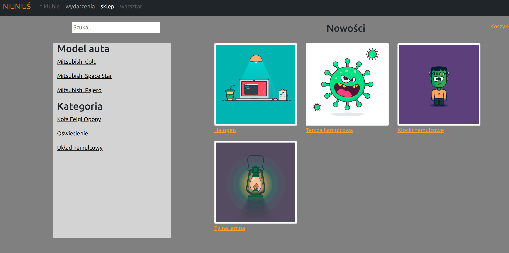
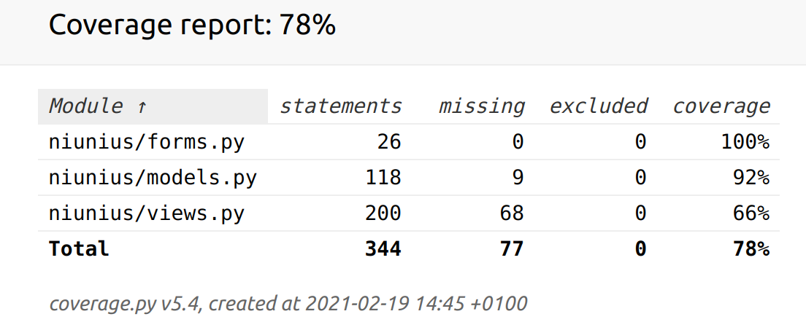

# NIUNIUŚ
This Django app is the website for the off-road club named "Niuniuś". 
The website consists of the home page and four subpages: about, blog, shop, and service station.
Blog and Shop subpages are ready to use, while About and Service Station are in progress and disabled for now.


In order to explore the project, ***clone this repository*** to your local machine.
You are very welcome to create pull requests if you find anything should be added/amended/deleted.

For start, follow the below steps:
1. create the virtual environment and run the command `pip install -r requirements.txt`
2. configure a database - in the project directory you need to create the file named ***local_settings.py*** and add there DATABASES with details of the database connection.
   These details will be imported by Django as in the file `setting.py` the below code is included:
   ```python
    try:
        from my_django_project.local_settings import *
    except ImportError:
        pass
    ```
3. run the command `python manage.py makemigrations` and then `python manage.py migrate`
4. load initial data to fill your database - use the command `python manage.py loaddata */fixtures/*.json`
5. finally run `python manage.py runserver` and enjoy the app :)

## Blog 



The Blog subpage display articles. Only an authenticated user can add a new article. 
After clicking on a title you are redirected to article details. Besides photo and description, there are three buttons:
comments, like and dislike. Like and Dislike can be used by everyone. As for comments, all users can read existing comments, byt only authenticated users can add a new comment.

## Shop



The shop is for car parts. You can search by car models or by categories, or type whatever you are looking for in the search field.
Products are assigned to car models and to categories.
All users are able to add products to the shopping cart. However, to place an order, you have to log in. 
Then, to proceed with the order, you have to fill in delivery details. 
For now the only payment option is a bank transfer. 

### Tests

If you are curious, the app has been tested. All tests passed, and the coverage percentage is 78%.
You can find tests in the *tests* catalogue. Run them with the command `pytest`. To generate the report, same as below one, use the command `xdg-open cov_html/index.html`


